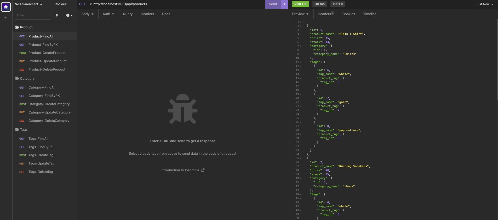

# Internet Retail Example

## Description
I built the back end for an e-commerce site. I leveraged Express.js to construct the available routes for the users to interact with the SQL database that supports the front end.

I separated my endpoints in three big categories
* `Products`
* `Categories`
* `Tags`

[Untitled_ Jan 23, 2023 10_04 PM.webm](https://user-images.githubusercontent.com/114036566/214205018-a3d301b8-802b-4c45-b8f6-0df23b8ac045.webm)

For each category, the following requests are available to you:

| Request | Endpoint | Description | 
| ------------- | ------------- | ------------- |
| `GET` | /api/***category***  | Sends a GET request to return all the instances of each ***category*** ( products/categories/tags) |
| `GET` | /api/***category***/***id*** | Sends a GET request to return specific ***category*** data filtered by the id |
| `POST` | /api/***category*** | Sends a POST request to create a new entry for the ***category*** |
| `PUT` | /api/***category***/***id*** | Sends a PUT request to update a specific entry for the  ***category*** |
| `DELETE` | /api/***category***/***id*** | Sends a DELETE request to remove a specific entry for the ***category*** |

## Table of Contents
- [Prerequisites](#prerequisites)
- [Installation](#installation)
- [Usage](#usage)
- [Credits](#credits)
- [License](#license)

## Prerequisites
* Since this is a node.js app, you will need to install node.js in your laptop.  
    * Download the latest version of node.js here --> https://nodejs.org/en/download/  
* After node.js has been installed on your machine, you will need to install npm.  
    * Follow the steps in the following website to install npm --> https://docs.npmjs.com/cli/v9/commands/npm-install?v=true  
* You will also need to have installed mySQL. 
    * Follow the steps in the following website to install npm --> https://www.mysql.com/

## Installation
* Download the repo
* Navigate to the `internetRetail` folder
* Install the prerequesites by running:
        
        npm i 
* Open `mysql` by running the following command: 

        mysql -u root -p
* Once inside of mysql, run the following command to create the squema
        
        source schema.sql
* Exit out of mysql by running

        exit 

### Create your model and seed it
* Install the prereques by running:

        npm run seed
* Start your server by running:

        `nodemon server.js`

**You can start sending your requests to the server**

## Usage
Open Insomnia/Postman and you can start testing out the different type of request. Aditionally, you can see how sequelize is leverage to construct the calls to mySQL

## Credits
* Me
* Myself
* I

Alberto De Armas --> https://github.com/nosbeto

## License

MIT License

Copyright (c) [2023] [Alberto De Armas]

Permission is hereby granted, free of charge, to any person obtaining a copy
of this software and associated documentation files (the "Software"), to deal
in the Software without restriction, including without limitation the rights
to use, copy, modify, merge, publish, distribute, sublicense, and/or sell
copies of the Software, and to permit persons to whom the Software is
furnished to do so, subject to the following conditions:

The above copyright notice and this permission notice shall be included in all
copies or substantial portions of the Software.

THE SOFTWARE IS PROVIDED "AS IS", WITHOUT WARRANTY OF ANY KIND, EXPRESS OR
IMPLIED, INCLUDING BUT NOT LIMITED TO THE WARRANTIES OF MERCHANTABILITY,
FITNESS FOR A PARTICULAR PURPOSE AND NONINFRINGEMENT. IN NO EVENT SHALL THE
AUTHORS OR COPYRIGHT HOLDERS BE LIABLE FOR ANY CLAIM, DAMAGES OR OTHER
LIABILITY, WHETHER IN AN ACTION OF CONTRACT, TORT OR OTHERWISE, ARISING FROM,
OUT OF OR IN CONNECTION WITH THE SOFTWARE OR THE USE OR OTHER DEALINGS IN THE
SOFTWARE.
